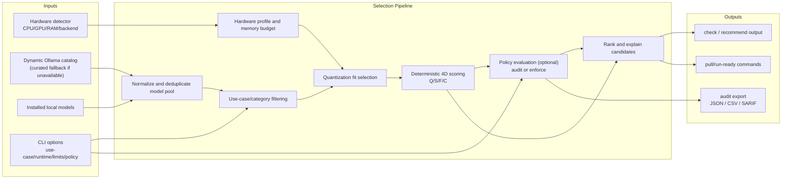

LLM Checker uses a deterministic pipeline so that the same inputs always produce the same ranked output, with explicit policy outcomes for governance workflows.

## Pipeline Flowchart



## Component Responsibilities

| Layer | Responsibility |
|-------|----------------|
| **Input layer** | Collects runtime constraints from hardware detection, local inventory, dynamic registry data, and CLI flags |
| **Normalization layer** | Deduplicates identifiers/tags and builds a canonical candidate set |
| **Selection layer** | Filters by use case, selects the best fitting quantization, and computes deterministic Q/S/F/C scores |
| **Governance layer** | Applies policy rules in `audit` or `enforce` mode and records explicit violation metadata |
| **Output layer** | Returns ranked recommendations plus machine-readable compliance artifacts when requested |

## Execution Stages

The pipeline runs through six sequential stages:

1. **Hardware profiling** — Detect CPU/GPU/RAM and effective backend capabilities.
2. **Model pool assembly** — Merge dynamic scraped catalog (or curated fallback) with locally installed models.
3. **Candidate filtering** — Keep only relevant models for the requested use case.
4. **Fit selection** — Choose the best quantization for the available memory budget.
5. **Deterministic scoring** — Score each candidate across Quality, Speed, Fit, and Context.
6. **Policy + ranking** — Apply optional policy checks, then rank and return actionable commands.

## Project Structure

```
src/
  models/
    deterministic-selector.js  # Primary selection algorithm
    scoring-config.js          # Centralized scoring weights
    scoring-engine.js          # Advanced scoring (smart-recommend)
    catalog.json               # Curated fallback catalog (35+ models, only if dynamic pool unavailable)
  ai/
    multi-objective-selector.js  # Multi-objective optimization
    ai-check-selector.js         # LLM-based evaluation
  hardware/
    detector.js                # Hardware detection
    unified-detector.js        # Cross-platform detection
  data/
    model-database.js          # SQLite storage (optional)
    sync-manager.js            # Database sync from Ollama registry
bin/
  enhanced_cli.js              # CLI entry point
```

## Key Source Files

<AccordionGroup>
  <Accordion title="src/models/deterministic-selector.js">
    The primary selection algorithm. Implements the 4D scoring pipeline (Q/S/F/C), quantization fit selection, MoE memory estimation, and runtime-aware MoE speed overhead. Used by `check` and `recommend`.
  </Accordion>

  <Accordion title="src/models/scoring-config.js">
    Centralized store for all scoring weight configurations. Exports three weight sets:
    - `DETERMINISTIC_WEIGHTS` — per-category `[Q, S, F, C]` arrays for the primary selector
    - `MULTI_OBJECTIVE_WEIGHTS` — five-factor weights including `hardwareMatch`
    - `SCORING_ENGINE_WEIGHTS` — `{Q, S, F, C}` objects with additional presets for `smart-recommend` and `search`
  </Accordion>

  <Accordion title="src/models/scoring-engine.js">
    Advanced scoring engine that powers `smart-recommend` and `search`. Reads weight presets from `scoring-config.js` and applies runtime-aware MoE speed estimation from `moe-assumptions.js`.
  </Accordion>

  <Accordion title="src/models/catalog.json">
    Built-in curated fallback catalog of 35+ models. Only loaded when the dynamic scraped Ollama pool is unavailable. Covers major families: Qwen, Llama, DeepSeek, Phi, Gemma, Mistral, CodeLlama, LLaVA, and embeddings models.
  </Accordion>

  <Accordion title="src/hardware/detector.js">
    Platform-specific hardware detection logic. Reads CPU, RAM, and GPU information. Handles Apple Silicon unified memory, NVIDIA CUDA, AMD ROCm VRAM normalization, and Intel Arc detection.
  </Accordion>

  <Accordion title="src/hardware/unified-detector.js">
    Cross-platform detection layer that merges outputs from platform-specific detectors. Preserves dedicated and integrated GPU topology separately for hybrid systems. Produces the canonical hardware profile consumed by the selection pipeline.
  </Accordion>

  <Accordion title="src/data/model-database.js">
    Optional SQLite storage layer (requires `sql.js`). Persists the scraped Ollama catalog to disk and serves queries for `search` and `smart-recommend`.
  </Accordion>

  <Accordion title="src/data/sync-manager.js">
    Fetches the latest model catalog from the Ollama registry and writes it to the local SQLite database. Invoked by `llm-checker sync`.
  </Accordion>

  <Accordion title="bin/enhanced_cli.js">
    The CLI entry point. Parses arguments, routes commands, enforces policy precedence (`--policy` > `--calibrated` > deterministic fallback), and formats output for both human-readable terminal display and machine-readable JSON.
  </Accordion>
</AccordionGroup>
